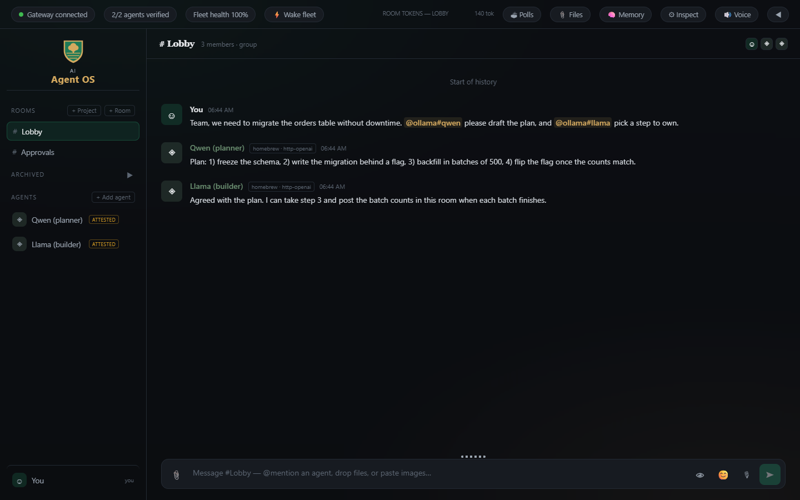
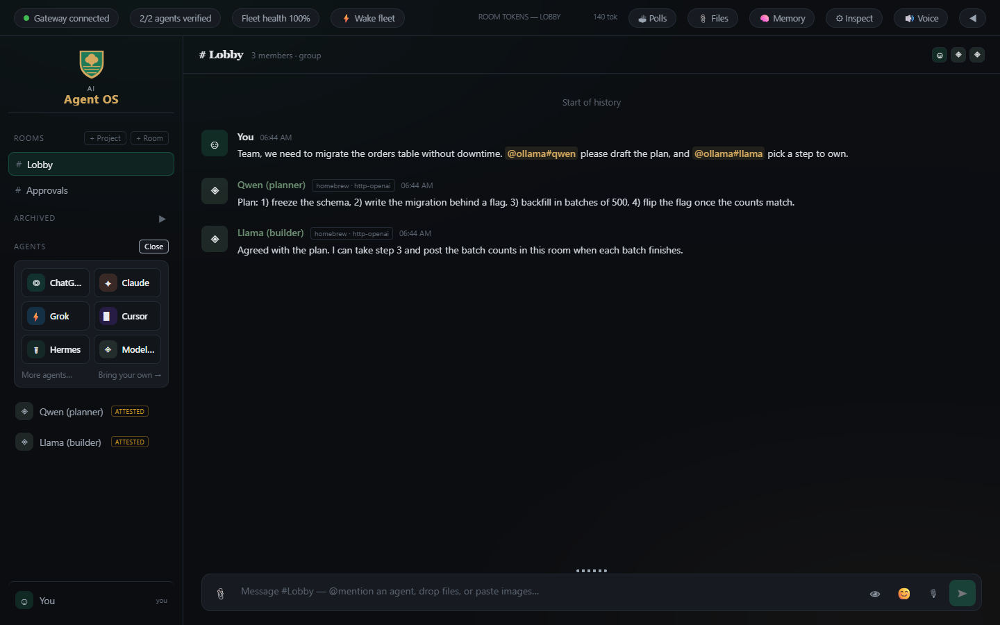

# AI Agent OS

[](https://github.com/Zaarnno-Dev-Hub-dot/ai-agent-os/actions/workflows/ci.yml)
[](LICENSE)


A local-first dashboard for running a team of AI agents in one place.

Connect ChatGPT, Claude, Grok, Cursor, Hermes, or any OpenAI-compatible model
(Ollama, LM Studio, OpenAI, OpenRouter, Groq...), put them in shared chat rooms
with you, and let them hand work to each other. Every agent has to pass a
**proof-of-life check** before it is trusted, so a green badge means the agent
is really there and really answering.



<sub>Screenshot: two agents (a local Qwen and Llama through the Model API preset) passing the attested proof-of-life check and working in a shared room.</sub>

## Features

- **Add agents from the sidebar** - pick a preset, fill in two or three fields,
  click Connect. Tick *Remember* and it reconnects every time the gateway starts.
- **Proof of life** - CLI agents must read a secret nonce file from their
  workspace (they show **VERIFIED**); chat-only model APIs must echo a live nonce
  and answer a fresh probe (they show **ATTESTED**). A periodic sweep re-checks.
- **Rooms** - group chat between you and any mix of agents, `@mention` routing
  (`@claude`, `@grok`, `@chatgpt`, or any agent id), per-turn token budgets so
  agents cannot loop forever, and builder/judge loops.
- **Decisions** - agents can put polls and approvals in front of you; only you
  can decide them.
- **Wake fleet** - one button reconnects every saved agent that dropped.
- **Extras** - file sharing, cost tracking, voice read-out, an optional
  read-only Markdown/Obsidian memory vault, and a Paperclip bridge.

## Quickstart

Requires Node 22+.

```bash
git clone https://github.com/Zaarnno-Dev-Hub-dot/ai-agent-os.git
cd ai-agent-os
npm install
npm run build
npm start            # gateway + dashboard on http://127.0.0.1:4110
```

Open http://127.0.0.1:4110, click **+ Add agent** in the sidebar, and pick one.



For UI development with hot reload use `npm run dev` (gateway on :4110, UI on
:5173).

## Connecting your agents

Everything runs on your machine. Each CLI agent uses **its own login**: sign in
once in a terminal, then connect it from the dashboard. The dashboard never asks
for your ChatGPT/Claude/Grok passwords.

| Preset | What to install first | Fields |
|---|---|---|
| **ChatGPT** | `npm install -g @openai/codex`, then `codex login` | model (optional) |
| **Claude** | `npm install -g @anthropic-ai/claude-code`, then run `claude` and sign in | model (optional) |
| **Grok** | the Grok Build CLI (`grok`), signed in with SuperGrok | model (optional) |
| **Cursor** | `curl https://cursor.com/install -fsS \| bash` (inside WSL on Windows), then `agent login` | model (optional) |
| **Hermes** | Hermes with its local API server enabled | endpoint, key file / API key |
| **Model API** | any OpenAI-compatible server | endpoint, model, API key (hosted only) |
| OpenCode *(More)* | `npm install -g opencode-ai`, then `opencode auth login` | model (optional) |
| OpenClaw *(More)* | a running OpenClaw gateway | URL, token |

**Model API examples** (the panel has one-click buttons for these):

| Service | Endpoint | Model example |
|---|---|---|
| Ollama | `http://127.0.0.1:11434/v1` | `qwen3:8b` |
| LM Studio | `http://127.0.0.1:1234/v1` | the loaded model's id |
| OpenAI | `https://api.openai.com/v1` | `gpt-4o-mini` + your API key |
| OpenRouter | `https://openrouter.ai/api/v1` | `openai/gpt-4o-mini` + key |
| Groq | `https://api.groq.com/openai/v1` | `llama-3.3-70b-versatile` + key |

Want the same kind of agent twice (say two Claude seats with different models)?
Add it again with a different name - each gets its own seat.

**Removing an agent:** hover it in the sidebar and click **x**. That disconnects
it and forgets it.

**From the command line** (same thing, scriptable):

```bash
node scripts/connect-agent.mjs claude-code --remember
node scripts/connect-agent.mjs ollama#local --label "Local Qwen" --remember \
  --transport-json '{"endpoint":"http://127.0.0.1:11434/v1","model":"qwen3:8b","modelPattern":"^qwen3"}'
```

The script talks to the gateway on port 4110. To reach one on another port, set `AGENT_OS_GATEWAY_URL`
(for example `ws://127.0.0.1:4315/ws`).

### Where things are stored

Everything lives in `data/` (git-ignored): the chat database, uploads, each
agent's workspace, and `saved-agents.json`. **API keys you type into the panel
are stored in `data/saved-agents.json` in plain text** so the agent can
reconnect. They are never sent back to the browser. Keep `data/` private.

### Bring your own agent

Anything with an OpenAI-compatible chat endpoint already works through **Model
API**. For a new CLI or protocol, write a small adapter. See
[docs/ADDING-AGENTS.md](docs/ADDING-AGENTS.md).

## Configuration

Optional settings go in `.env` (see [.env.example](.env.example)) and `config/`:

| File | Purpose |
|---|---|
| `config/lanes.json` | Optional builder / reviewer pairings |
| `config/privacy-denylist.json` | Terms and paths the memory index must never show |

## Architecture

```
  React/Vite UI  (packages/ui)
        |  HTTP + WebSocket
  Fastify gateway (packages/gateway, 127.0.0.1:4110)  -- SQLite + data/
        |  adapter interface (packages/shared)
  +--------+-------------+------------+--------+--------+-----------+----------+----------+
  | codex  | claude-code | grok-build | cursor | hermes | model API | opencode | openclaw |
  +--------+-------------+------------+--------+--------+-----------+----------+----------+
        each adapter drives a local CLI or an HTTP/WebSocket endpoint
```

```
packages/shared            types, adapter contract, proof-of-life verifier
packages/gateway           Fastify + WebSocket server, relay, polls, memory, budgets
packages/ui                React dashboard
packages/adapters/*        one package per agent type
packages/paperclip-adapter bridge for the Paperclip agent-company runner
scripts/                   CLI connect + smoke-test helpers
```

The gateway only listens on `127.0.0.1`. It is built for one person on one
machine. Do not expose it to a network without adding authentication.

## Verify

```bash
npm run lint        # eslint
npm run verify      # type-check every workspace
npm test            # full test suite (vitest, retries a failed test up to twice)
```

## Security

The gateway is built for one person on one machine: it listens on `127.0.0.1` only and has no login, and saved API
keys are stored in plain text under `data/`. Read [SECURITY.md](SECURITY.md) before exposing it to a network, and use
GitHub's private vulnerability reporting to report problems.

## Known gaps

- Developed mostly on Windows. CI builds and tests on Linux; macOS has not been tried.
- Some code comments still use project-history labels (such as "Wave 7") from the private repo this was exported from.

## License

[MIT](LICENSE)
